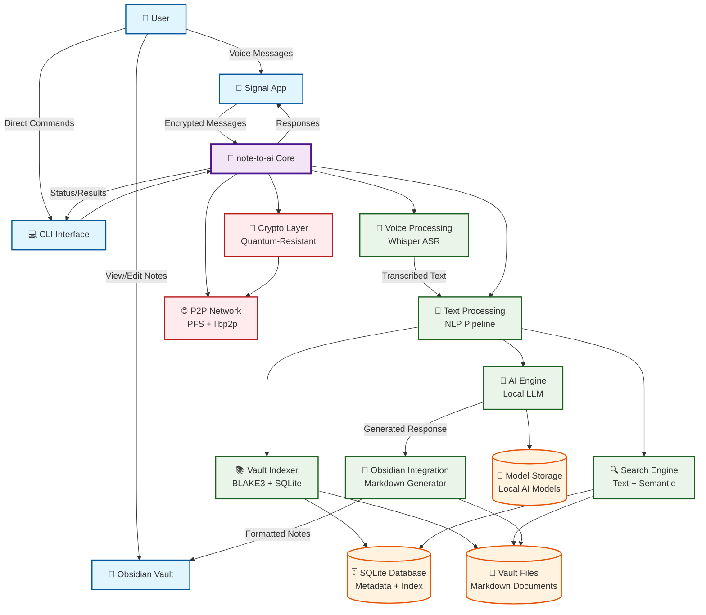
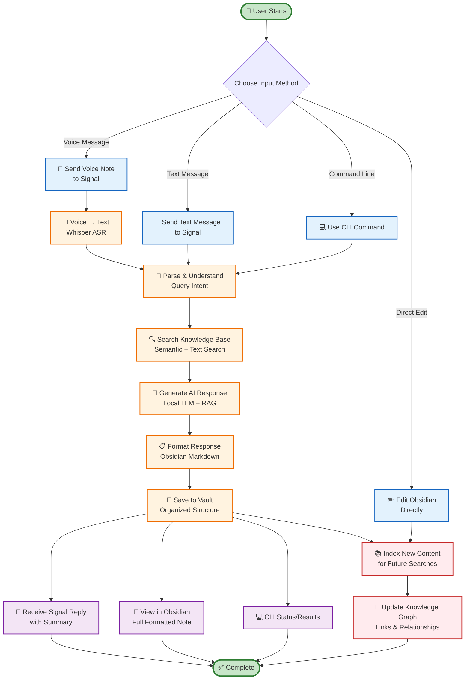

# Note-to-AI Architecture & User Flow Diagrams

This document provides visual representations of the note-to-ai system architecture and user workflows to help users understand how the system operates.

## 🏗️ System Architecture Diagram



## 🔄 User Workflow Diagram



## 🎯 Key User Scenarios

### Scenario 1: Voice-to-Knowledge Workflow
```
📱 User sends voice note via Signal
    ↓
🎤 Whisper transcribes audio to text
    ↓
🧩 System parses intent and extracts key concepts
    ↓
🔍 Searches existing knowledge base for relevant context
    ↓
🤖 Local LLM generates comprehensive response with RAG
    ↓
📝 Creates formatted Obsidian note with metadata, tags, links
    ↓
💾 Saves to organized vault structure (/AI Responses/YYYY-MM-DD/)
    ↓
📱 Sends summary back to Signal + 📝 Full note available in Obsidian
```

### Scenario 2: Research & Knowledge Building
```
💻 User runs CLI indexing command
    ↓
📚 System scans vault for new/changed markdown files
    ↓
🔐 BLAKE3 hashing detects content changes
    ↓
🗄️ Updates SQLite database with metadata and full-text index
    ↓
🔍 Builds searchable knowledge graph
    ↓
🤖 Future queries can leverage this indexed knowledge
    ↓
🧠 Continuous learning and knowledge accumulation
```

### Scenario 3: Daily Knowledge Management
```
🌅 Daily Note Creation:
   - Automatic daily note generation
   - Time-stamped interaction logs
   - Cross-linked to relevant knowledge

📝 AI Response Notes:
   - Query-based file naming
   - Structured frontmatter with metadata
   - Automatic tag generation and linking

🔗 Knowledge Graph Building:
   - Automatic [[wikilink]] generation
   - Tag-based organization (#ai-generated, #research)
   - Temporal knowledge tracking
```

## 🛠️ System Components Detail

### Core Technologies Stack
```
Frontend Interfaces:
├── 📱 Signal (Encrypted Messaging)
├── 💻 CLI (Command Line Interface)  
└── 📝 Obsidian (Knowledge Management)

Processing Engine:
├── 🎤 Whisper (Speech-to-Text)
├── 🧠 Local LLM (Hermes-3-8B)
├── 🔍 Hybrid Search (Text + Semantic)
└── 📚 Document Indexer (BLAKE3 + SQLite)

Storage Layer:
├── 🗄️ SQLite Database (Metadata & Index)
├── 📁 Markdown Files (Human-readable knowledge)
└── 🧠 Local AI Models (Self-contained inference)

Security & Privacy:
├── 🔐 End-to-end encryption (Signal Protocol)
├── 🛡️ Quantum-resistant cryptography
├── 🏠 Local-first architecture (no cloud dependency)
└── 🌐 Optional P2P synchronization (IPFS)
```

### Data Flow Architecture
```
Input → Processing → Storage → Output
  ↓         ↓          ↓        ↓
Voice     Parse     SQLite   Signal
Text   → Search  → Markdown → Obsidian
CLI      AI Gen    Models     CLI
```

## 🎯 Benefits Summary

### For Users:
- **🏠 Privacy-First**: All processing happens locally
- **🧠 Intelligent**: AI-powered responses with context from your knowledge
- **📝 Organized**: Automatic knowledge management in Obsidian format
- **🔍 Searchable**: Full-text and semantic search across all content
- **⚡ Fast**: Local processing, no network dependencies for core features

### For Developers:
- **🦀 Rust Performance**: High-performance, memory-safe implementation
- **🔧 Modular Design**: Clean separation of concerns
- **🧪 Testable**: Comprehensive test suite with benchmarks
- **📦 Self-contained**: Minimal external dependencies
- **🔒 Secure**: Quantum-resistant cryptography foundation

---

*This architecture enables a completely local-first AI knowledge management system that respects user privacy while providing powerful AI-assisted note-taking and knowledge discovery capabilities.*
