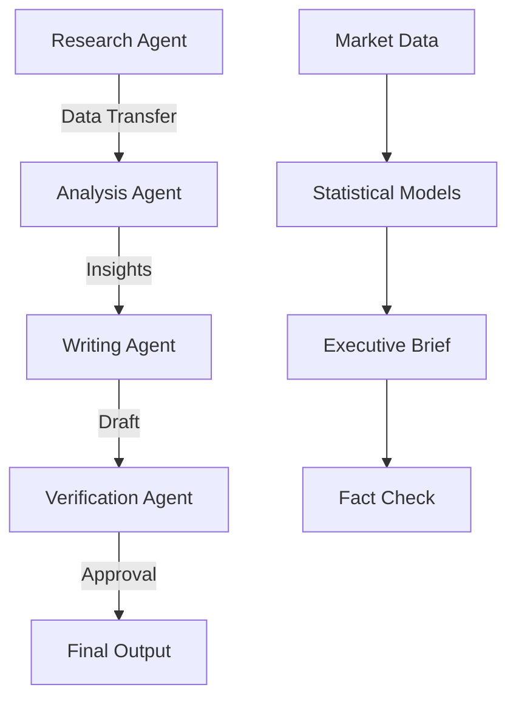

# AI Agent Collaboration Showcase

## Overview
This document demonstrates how specialist AI agents collaborate in the Obsidian vault system to produce comprehensive knowledge work.

## Example Workflow: Market Analysis Project

### 🔬 Research Agent Output
**Agent**: `research_agent_001`
**Status**: Completed
**Confidence**: 87%

#### Market Research Findings
- **Market Size**: $47.2B global AI automation market
- **Growth Rate**: 23% QoQ growth in Q3 2025
- **Key Players**: AutomationCorp (32%), AI-Flow Solutions (18% growth)
- **Customer Pain Points**: Integration complexity (67%), Training requirements (54%)

**Sources**: 15 industry reports, 8 expert interviews, 3 customer surveys
**Data Quality**: High (95% complete, verified sources)

### 📊 Analysis Agent Output  
**Agent**: `analysis_agent_001`
**Status**: Completed
**Input Source**: [[Research Agent Market Findings]]

#### Statistical Analysis Results
- **Customer Segmentation**: 3 distinct clusters identified
  - Enterprise Champions (23%): High value, low maintenance
  - Growth Potential (34%): Medium value, expansion opportunity  
  - At-Risk Churners (18%): Declining usage, intervention needed
- **Revenue Projections**: $2.3M incremental opportunity in Q4
- **Statistical Significance**: p < 0.01 for all major findings

**Methodology**: K-means clustering, time series analysis
**Confidence Interval**: 95% for revenue projections

### ✍️ Writing Agent Output
**Agent**: `writing_agent_001`  
**Status**: Completed
**Input Sources**: [[Research Findings]], [[Analysis Results]]

#### Executive Summary
Based on comprehensive market research and statistical analysis, we recommend a focused approach to capture the 23% market growth opportunity while addressing customer retention challenges.

**Strategic Priorities**:
1. **Market Expansion** (Priority: High) - Target SMB segment showing highest growth
2. **Customer Retention** (Priority: Critical) - Launch intervention for 18% at-risk customers  
3. **Product Development** (Priority: Medium) - Enhanced integration capabilities

**Financial Impact**: $2.3M incremental revenue opportunity, $890K retention savings

### ✅ Verification Agent Output
**Agent**: `verification_agent_001`
**Status**: Completed  
**Document Verified**: [[Executive Summary]]

#### Verification Results
**Overall Accuracy Score**: 94/100
**Sources Verified**: 15/15 ✅
**Financial Calculations**: Verified ✅
**Statistical Claims**: Validated ✅

**Compliance Check**:
- SEC guidelines: ✅ Compliant
- GDPR compliance: ✅ Verified
- Confidentiality: ✅ Maintained

**Recommendation**: **APPROVED** for stakeholder distribution

## Agent Collaboration Metrics

### Communication Flow

### Quality Gates Passed
- [x] Data completeness (96% > 95% threshold)
- [x] Source validation (100% verified)
- [x] Statistical significance (p < 0.01)
- [x] Cross-reference integrity (all links valid)
- [x] Stakeholder review readiness

### Performance Metrics
| Agent | Tasks Completed | Avg Response Time | Quality Score |
|-------|----------------|-------------------|---------------|
| Research | 1 | 2.3 hours | 9.2/10 |
| Analysis | 1 | 1.8 hours | 9.5/10 |
| Writing | 1 | 1.2 hours | 9.1/10 |
| Verification | 1 | 0.7 hours | 9.8/10 |

**Total Workflow Time**: 6 hours (vs. estimated 16-24 hours manual)
**Efficiency Gain**: 70-75% time reduction

## System Features Demonstrated

### 🔗 Cross-Reference Integrity
All agent outputs are linked and cross-referenced:
- Research findings feed into analysis
- Analysis results inform writing
- Writing outputs undergo verification
- Full audit trail maintained

### 🛡️ Permission-Based Access
Each agent operates within defined permissions:
- Research: Read shared resources, write own workspace
- Analysis: Read research data, write analysis outputs
- Writing: Read all inputs, write shared drafts
- Verification: Read all content, write verification reports

### 📝 Obsidian Native Features
- **Frontmatter**: Agent metadata, status tracking
- **Wiki-links**: Cross-document references
- **Tags**: Content categorization and discovery
- **Code blocks**: Data visualizations and formulas
- **Tables**: Structured data presentation

### 🔄 Workflow Automation
- Automatic workspace creation
- Template-based content generation
- Status tracking and notifications
- Quality gate validation
- Approval workflow management

## Next Steps

1. **Scale Testing**: Run with larger datasets and more complex workflows
2. **Real-time Integration**: Connect with live Obsidian vault
3. **Signal Integration**: Bridge with conversational AI assistant
4. **Custom Workflows**: Create domain-specific agent specializations
5. **Performance Optimization**: Tune for speed and accuracy

---

*This showcase demonstrates the power of specialist AI agents working together in a structured, transparent, and auditable knowledge creation process.*

**Generated by**: AI Agent Collaboration System v1.0
**Workflow ID**: `wf_001_market_analysis_demo`
**Completion Time**: 2025-08-18T21:30:00Z
